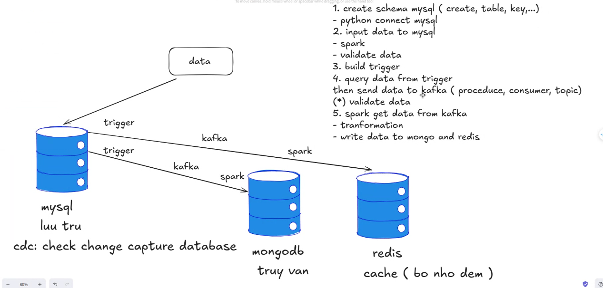

# Data Synchronization Project

This project provides a solution for synchronizing data from the primary MySQL database to other databases such as MongoDB and Redis for querying and caching. The solution supports both initial data loading and ongoing data changes (INSERT, UPDATE, DELETE), collected via MySQL Triggers and processed through a robust data pipeline built with Apache Kafka and Apache Spark.



## Project Overview

The system is designed to handle data synchronization across different databases using Apache Spark for processing and Apache Kafka for streaming. It implements a multi-threaded approach for optimal performance.

## Architecture

- **ETL Pipeline**: Implements data extraction, transformation, and loading processes
- **Multiple Database Support**: MongoDB, MySQL, and Redis integration
- **Apache Spark Integration**: For distributed data processing
- **Kafka Streaming**: Data Transfer with multi-threading support

## Project Structure

```
├── config/                     # Configuration files
│   ├── database_config.py     # Database configuration settings
│   └── spark_config.py        # Spark configuration settings
├── data/                      # Data files
├── database/                  # Database connection modules
│   ├── mongodb_connect.py     # MongoDB connection handler
│   ├── mysql_connect.py       # MySQL connection handler
│   ├── redis_connect.py       # Redis connection handler
│   └── schema_manager.py      # Database schema management
├── lib/                       # External libraries and dependencies
├── sql/                      # SQL scripts
│   ├── schema.sql            # Database schema definitions
│   └── trigger.sql           # Database triggers
├── src/                      # Source code
│   ├── main.py              # Main application entry point
│   ├── etl/                 # ETL processing modules
│   │   ├── consumer.py      # Data consumer implementation
│   │   ├── spark_consumer.py # Spark-based consumer
│   │   └── trigger_kafka.py # Kafka trigger implementations
│   └── spark/               # Spark processing modules
│       ├── main.py          # Spark main processing
│       └── spark_write_data.py # Data writing with Spark
├── docker-compose.yml        # Docker composition file
└── requirements.txt         # Python dependencies
```

## Prerequisites

- Python 3.12+
- Apache Spark
- Apache Kafka
- MongoDB
- MySQL
- Redis
- Docker and Docker Compose

## Dependencies

The project requires several Python packages and external libraries. Key dependencies include:

- Apache Spark Connector for MongoDB
- MySQL Connector
- Redis JDBC Driver
- BSON Library
- Other dependencies listed in `requirements.txt`

## Workflow and Architecture

### 1. Logic 1: Set up Databases with Docker  
- Pull Docker images for **MySQL**, **MongoDB**, and **Redis**.  
- Configure users and passwords.  
- Create schemas for each database and validate them.  

### 2. Logic 2: Insert Data into Databases using Spark  
- Set up and configure **Apache Spark**.  
- Write data into **MySQL**, **MongoDB**, and **Redis** simultaneously.  
- Validate that Spark has written all data correctly without missing records.  

### 3. Logic 3: Implement Change Data Capture (CDC) on MySQL with Kafka  
- Set up **Kafka** and **Zookeeper**.  
- Implement a **CDC mechanism** on MySQL using triggers to capture data changes (**Insert, Update, Delete**).  
- Write captured changes in real-time to a Kafka topic.  

### 4. Logic 4: Stream and Validate Data with Spark, Kafka  
- Use **Spark Structured Streaming** to read change data from Kafka.  
- Develop a Kafka Consumer(for transfer) and Spark(any time spark load to database) with integrated validation to ensure:  
  - Correct schema  
  - Valid data format  
  - Transmission integrity  

### 5. Logic 5: Data Validation and Synchronization to MongoDB and Redis  
- After passing validation, the Consumer acts as a Producer to forward the validated data to a new Kafka topic.  
- **Spark Structured Streaming** consumes data from the validated topic, applies the required transformations, and writes the final changes (**Insert, Update, Delete**) to **MongoDB** and **Redis**.  


## Configure the databases:
- Execute SQL scripts in the `sql/` directory
- Configure connection settings in `config/database_config.py`
- Set up Spark configurations in `config/spark_config.py`

## Usage

1. Start the Spark processing engine:
```bash
python src/spark/main.py
```

2. Initialize the Kafka consumers:
```bash
python src/etl/trigger_kafka.py
```

## Features

- Data synchronization
- Multi-threaded Kafka consumer implementation
- Distributed data processing with Apache Spark
- Support for multiple database systems
- Schema management and validation
- Docker containerization

## Configuration

- Database configurations are managed in `config/database_config.py`
- Spark settings can be modified in `config/spark_config.py`
- Docker services are defined in `docker-compose.yml`

## License

This project is licensed under the MIT License - see the LICENSE file for details.

## Author

AnhQuanengineer

## Acknowledgments

- Apache Spark Community
- Apache Kafka Community
- MongoDB, MySQL, and Redis Communities
